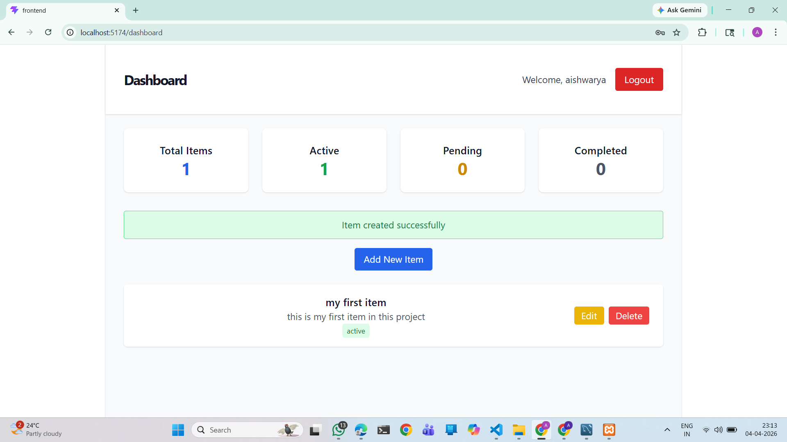

# MERN Stack Application with MySQL Authentication and CRUD

A full-stack web application built with the MERN stack (MongoDB replaced with MySQL) featuring user authentication, password reset functionality, and a comprehensive dashboard for managing user items with full CRUD operations.

## Features

- **User Authentication**: Register, login, logout with JWT tokens
- **Password Reset**: Secure password reset via email
- **Dashboard**: View statistics and manage personal items
- **CRUD Operations**: Create, read, update, and delete items
- **Responsive Design**: Mobile-friendly UI with Tailwind CSS
- **MySQL Database**: Relational database with proper indexing and foreign keys

## Tech Stack

### Backend
- Node.js
- Express.js
- MySQL (mysql2)
- JWT (jsonwebtoken)
- bcryptjs
- Nodemailer
- CORS

### Frontend
- React.js
- React Router
- Axios
- Tailwind CSS
- Context API for state management

## Prerequisites

- Node.js (v14 or higher)
- MySQL Server (XAMPP recommended)
- Git

## Installation

### 1. Clone the Repository
```bash
git clone <repository-url>
cd mern-mysql-auth-crud
```

### 2. Backend Setup
```bash
cd backend
npm install
```

### 3. Frontend Setup
```bash
cd ../frontend
npm install
```

### 4. Database Setup
1. Start MySQL server (via XAMPP or standalone)
2. Run the database schema:
   ```bash
   mysql -u root < ../database.sql
   ```

### 5. Environment Configuration
1. Copy `.env.example` to `.env` in the backend folder
2. Update the following variables:
   ```
   DB_HOST=localhost
   DB_USER=root
   DB_PASSWORD=your_mysql_password
   JWT_SECRET=your_jwt_secret_key
   EMAIL_USER=your_gmail@gmail.com
   EMAIL_PASS=your_gmail_app_password
   ```

## Running the Application

### Start Backend
```bash
cd backend
npm run dev
```
Server will run on http://localhost:5000

### Start Frontend
```bash
cd frontend
npm run dev
```
Application will run on http://localhost:5173

## API Endpoints

### Authentication
- `POST /api/auth/register` - User registration
- `POST /api/auth/login` - User login
- `POST /api/auth/forgot-password` - Request password reset
- `POST /api/auth/reset-password` - Reset password
- `GET /api/auth/me` - Get current user (protected)

### Items (Protected Routes)
- `GET /api/items` - Get all user items
- `GET /api/items/:id` - Get single item
- `POST /api/items` - Create new item
- `PUT /api/items/:id` - Update item
- `DELETE /api/items/:id` - Delete item
- `GET /api/items/stats` - Get dashboard statistics

## Database Schema

### Users Table
- id (Primary Key)
- name, email, phone
- password (hashed)
- reset_token, reset_token_expiry
- timestamps

### Items Table
- id (Primary Key)
- user_id (Foreign Key)
- title, description
- status (active/pending/completed)
- timestamps

## Usage

1. Register a new account or login with existing credentials
2. Access the dashboard to view statistics
3. Add new items using the form
4. Edit or delete existing items
5. Use password reset if needed

## Security Features

- Password hashing with bcryptjs
- JWT token authentication
- Parameterized SQL queries to prevent injection
- CORS configuration
- Input validation

## Development

### Project Structure
```
mern-mysql-auth-crud/
├── backend/
│   ├── config/db.js
│   ├── controllers/
│   ├── middleware/
│   ├── routes/
│   ├── server.js
│   └── package.json
├── frontend/
│   ├── src/
│   │   ├── api/
│   │   ├── components/
│   │   ├── context/
│   │   └── App.jsx
│   └── package.json
├── database.sql
└── README.md
```

### Testing
- Use Postman for API testing
- Check MySQL Workbench for database verification
- Test all CRUD operations and authentication flows

## Screenshots

### Login Page


### Forgot Password Page


### Reset Password Page


### Dashboard

